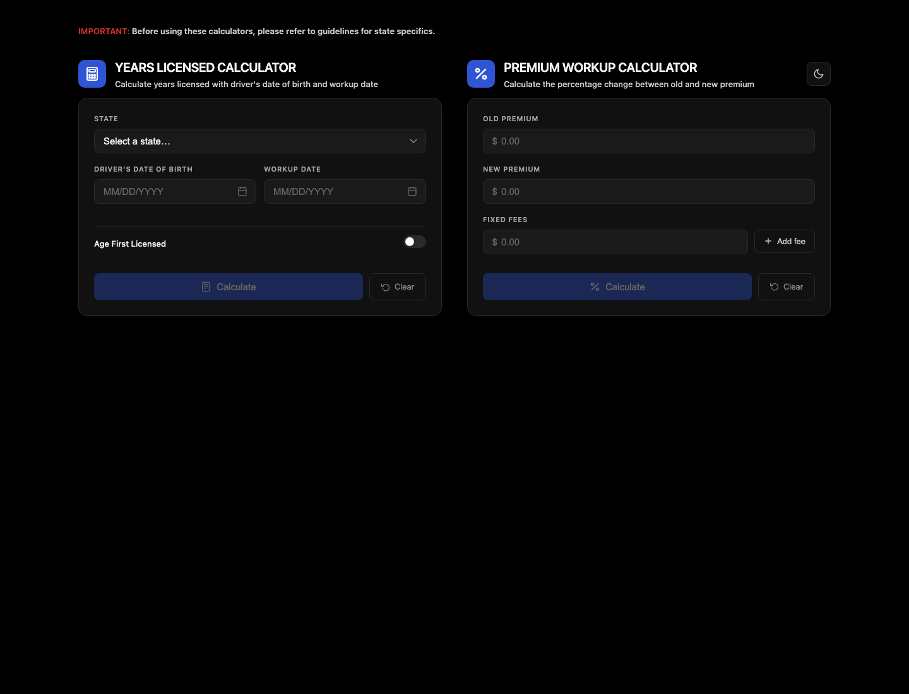

# AP Workup Tool

Insurance workup calculators for quickly checking driver experience and premium changes during underwriting or remarketing reviews.

**Live demo:** [ap-workup-tool.vercel.app](https://ap-workup-tool.vercel.app)



## What It Does

AP Workup Tool combines two browser-based calculators in one compact interface:

- Years Licensed Calculator estimates driver experience from date of birth, workup date, and state-specific licensing assumptions.
- Premium Workup Calculator compares old and new premiums, includes fixed fees, and reports percentage movement.
- Light and dark themes make the tool comfortable for repeated desk use.
- Everything runs client-side, so there is no backend setup or account requirement.

## Tech Stack

- HTML5
- CSS custom properties and responsive layout
- Vanilla JavaScript
- Local storage for theme preference
- Vercel for deployment

## Run Locally

Open `index.html` directly in a browser, or serve the folder with any static file server.

```bash
npx serve .
```

## Project Status

This is a focused utility app for real-world insurance workup workflows. Future improvements could include exporting workup summaries and expanding state-specific rule coverage.
